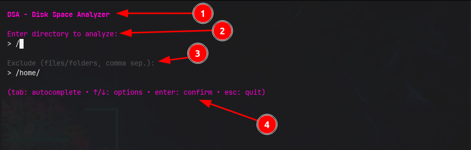
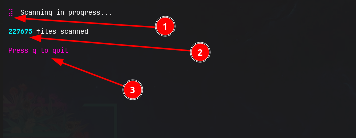
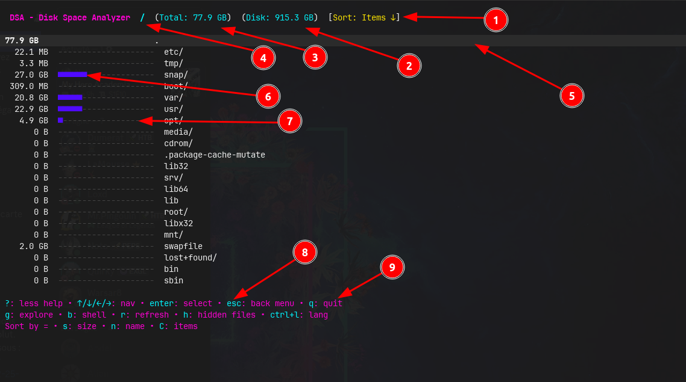

#AED


[](https://golang.org/)
[](https://github.com/Quirky1869/aed/releases)
[](https://github.com/Quirky1869/aed/actions/workflows/release.yml)
[](https://github.com/Quirky1869/aed/actions/workflows/translate-en-readme.yml)

## English README :gb:

An English version of the README is available [here](README-en.md)

## Summary
<p align="center">
<a href="https://golang.org" target="_blank" rel="noreferrer">

</a>
</p>

AED (Disk Space Analyzer) is an interactive disk explorer for terminal. It recursively scans a given folder to show which files or subfolders are consuming the most space.

## Features

Smart scan: Recursive scan that sorts elements by size, name or number of elements and manages hardlinks (via inodes).

Clear visualization: Shows colored progress bars to instantly identify large items.

Ergonomic navigation: Compatible with directional arrows (↑/↓/←/→) and Vim keys (h, j, k, l) to navigate the tree.

>[!TIP]
> Options:
> - ? : Show help
> - esc: Return to main menu
> - b: Opens a shell (terminal) directly in the selected folder
> - g: Opens the folder or file in the OS graphical explorer (xdg-open)
> - r: Allows you to re-scan the current folder
> - ctrl+l: Allows you to switch the language between French:fr: and English:gb:
> - s: Sort by size (Ascending/Descending)
> - n: Sort by name (Ascending/Descending)
> - C: Sort by number of elements (Ascending/Descending)
> - e: Show or hide hidden files

## Project structure

```
.
├── go.mod
├── cmd/
│ └── app/
│   └── main.go # Program entry
├── scan/
│ └── scanner.go # Scan logic, FileNode, utilities
└── ui/
├── autocomplete.go # Autocompletion file (Tab)
├── lang.go # Language file (FR, EN)
├── model.go # Structure Model, Update() and Init()
├── styles.go # Lipgloss Styles
└── view.go # View() function and formatting
```

## Facility

### Go.dev

You can use AED by downloading it directly from [pkg.go.dev](https://pkg.go.dev/github.com/quirky1869/aed):

`go install github.com/quirky1869/aed/cmd/aed@latest`

You will need to have Go installed on your PC

<details>
<summary style="font-weight: bold; color: #500aff;">Go installation procedure (Click to expand)</summary>

```bash
# Delete a possible old version of Go
sudo rm -rf /usr/local/go

# Unzip the downloaded file to /usr/local
# (Adapt file path and name if necessary)
sudo tar -C /usr/local -xzf ~/Downloads/go1.25.3.linux-amd64.tar.gz

# Add Go to PATH and set GOPATH
# Open your ~/.bashrc or ~/.zshrc file
micro ~/.zshrc

# Append at end of file
export PATH=$PATH:/usr/local/go/bin
export GOPATH=$HOME/go
export PATH=$PATH:$GOPATH/bin

# Reload shell configuration
source ~/.zshrc

# Check the correct installation
go version
```
</details>

> Uninstallation
> `rm $(go env GOPATH)/bin/aed`

### Releases

The [releases](https://github.com/Quirky1869/aed/releases) are available [here](https://github.com/Quirky1869/aed/releases)


### Snap

Via snap store

In progress... 🛠️

## Colors

You can change the interface colors from the `ui/styles.go` file

<details>
<summary style="font-weight: bold; color: #500aff;">ui/styles.go (Click to expand)</summary>

### File selection and exclusions



> - 1 = titleStyle
> - 2 = helpDescStyle
> - 3 = inactiveStyle
> - 4 = helpDescStyle

### Scan


> - 1 = spinnerStyle
> - 2 = countStyle
> - 3 = helpDescStyle

### AED



> - 1 = sortStyle
> - 2 = infoStyle
> - 3 = infoStyle
> - 4 = pathStyle
> - 5 = selectedStyle
> - 6 = barFull
> - 7 = barEmpty
> - 8 = helpKeyStyle
> - 9 = helpDescStyle
> - 10 = hiddenStyle
> - 11 = fileCountStyle

</details>

## Technologies used

| Bookstore | Use |
| ------------------------------------------------------------ | ------------------------------------ |
| [Bubble Tea](https://github.com/charmbracelet/bubbletea) | Management of the TUI interface |
| [Lipgloss](https://github.com/charmbracelet/lipgloss) | Stylizing text and borders |
|  [Golang](https://go.dev) | Core language and business logic |


## Author

Project developed by Quirky

<a href="https://github.com/Quirky1869" target="_blank">
 GitHub
</a>
